# Hey, I'm Harry 👋

💻 Developer • 🛠️ Builder • 🎮 Gamer
🇦🇺 Australia

I like building random projects, experimenting with new tech, and turning ideas into things people can actually use.

---

## 🚀 What I'm Working On

* 🌐 Web projects & experiments
* 🤖 Discord bots and automation
* 🎮 Minecraft & gaming projects
* 🐧 Linux / servers / self-hosting
* ☁️ Cloudflare Workers & web infrastructure
* 🔧 Hardware, homelab & random tech projects

---

## 🧰 Tech I Use

---

## 📊 GitHub Stats (Dark Mode)

  
  

---

## 🐍 Contribution Snake (Dark Mode)

  

---

## 🌐 Find Me

* 💻 GitHub: [@xzlr-8](https://github.com/xzlr-8)
* 🌎 Website: [noonhack.online](https://noonhack.online)

---

  <i>Building things, breaking things, learning things.</i>

